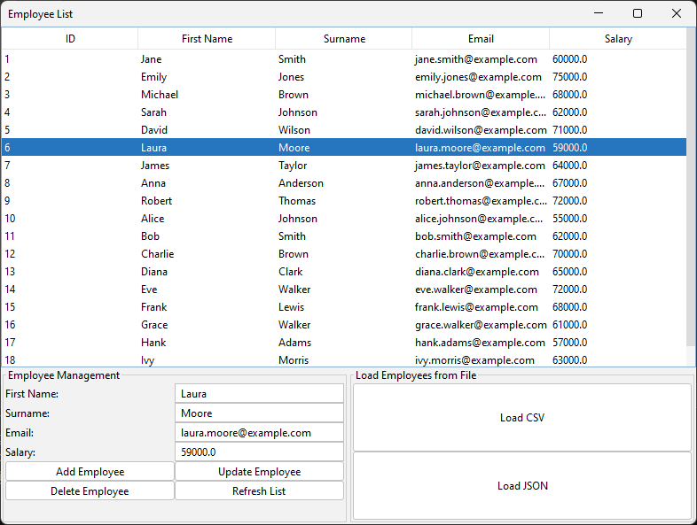
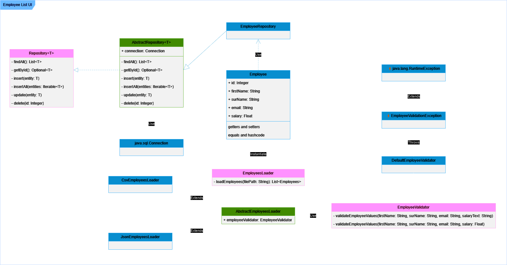

# Employee List UI

[](https://openjdk.org/)
[](https://maven.apache.org/)
[](https://www.mysql.com/)
[](https://git-scm.com/)
[](https://github.com/)

> **[English Version](./README.md)**

Una interfaz para gestionar empleados (Employees), desarrollada como parte del [curso de Java SE SQL y Bases de Datos en Platzi](https://platzi.com/cursos/java-sql/). Esta aplicación permite realizar diversas operaciones CRUD y facilita la carga de datos desde archivos CSV y JSON. Es una personalización del [proyecto trabajado a lo largo del curso](https://github.com/platzi/java-sql).

- Se adhiere al [**patrón de inyección de dependencias**](https://www.arquitecturajava.com/el-patron-de-inyeccion-de-dependencia/), promoviendo la modularida y la mantenibilidad del código.
- Contiene un solido **mecanismo de registro** que garantiza un seguimiento completo de eventos y errores de la aplicación.
- Utiliza **JDBC (Java Database Connectivity)** para interactuar con la base de datos MySQL, proporcionando un mecanismo sólido para las operaciones de la base de datos.

## Funcionalidades

- **Listado de empleados**: Visualiza una lista completa de todos los empleados registrados.
- **Añadir nuevo empleado**: Agrega nuevos empleados a la base de datos de manera sencilla.
- **Actualizar empleado existente**: Modifica la información de empleados ya registrados.
- **Eliminar empleado existente**: Elimina registros de empleados de la base de datos.
- **Importar empleados desde CSV y JSON**: Carga y valida empleados a partir de archivos CSV y JSON.



## Diagrama UML



## Instalación y Uso

### Prerrequisitos

- JDK 11 o superior
- Apache Maven
- MySQL

### Configuración

1. Clona este repositorio:
    ```bash
    git clone https://github.com/dafortch/employee-list-ui.git
    ```
2. Compila el proyecto utilizando Maven:
    ```bash
    mvn clean install
    ```
3. Configura tu base de datos MySQL y ajusta los parámetros de conexión en el archivo `application.properties`.
    ```conf
    jdbc.url=jdbc:mysql://localhost:3306/employee_list_ui
    jdbc.user=<usuario>
    jdbc.password=<contraseña>
    jdbc.driver=com.mysql.cj.jdbc.Driver
    ```

### Compilar y Ejecutar

1. Navega al directorio del proyecto:
    ```bash
    cd employee-list-ui
    ```
2. Compila el proyecto utilizando Maven:
    ```bash
    mvn clean install
    ```
3. Ejecuta la aplicación:
    ```bash
    java -jar target/employee-list-ui.jar
    ```

## Licencia

Este proyecto está bajo la licencia MIT. Para más detalles, consulta el archivo [LICENSE](LICENSE).
