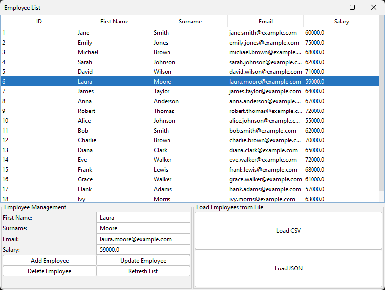
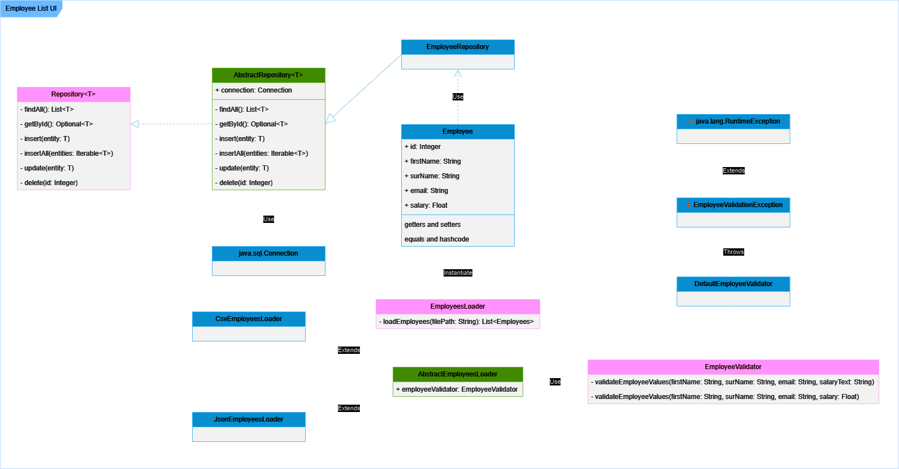

# Employee List UI

[](https://openjdk.org/)
[](https://maven.apache.org/)
[](https://www.mysql.com/)

> **[Versión Español](./README-es.md)**

An interface to manage employees, developed as part of the [Java SE SQL and Databases course at Platzi](https://platzi.com/cursos/java-sql/). This application allows you to perform various CRUD operations and makes it easy to load data from CSV and JSON files. It is a customization of the [project worked throughout the course](https://github.com/platzi/java-sql).

- Adheres to the [**dependency injection pattern**](https://en.wikipedia.org/wiki/Dependency_injection), promoting modularity and maintainability of the code.
- Contains a robust **logging mechanism** that ensures complete application event and error tracking.
- It uses **JDBC (Java Database Connectivity)** for interacting with the MySQL database, providing a robust mechanism for database operations.
## Features

- **Employee List**: View a complete list of all registered employees.
- **Add new employee**: Add new employees to the database easily.
- **Update existing employee**: Modify the information of already registered employees.
- **Delete existing employee**: Delete employee records from the database.
- **Import employees from CSV and JSON**: Load and validate employees from CSV and JSON files.



## UML diagram



## Installation and Use

### Prerequisites

- JDK 11 or higher
- Apache Maven
- MySQL

### Setting

1. Clone this repository:
    ```bash
    git clone https://github.com/dfortch18/employee-list-ui.git
    ```
2. Navigate to the project directory:
    ```bash
    cd employee-list-ui
    ```
3. Configure your MySQL database and adjust the connection parameters in the `application.properties` file.
    ```conf
    jdbc.url=jdbc:mysql://localhost:3306/employee_list_ui
    jdbc.user=<user>
    jdbc.password=<password>
    jdbc.driver=com.mysql.cj.jdbc.Driver
    ```

### Compile and Run

1. Navigate to the project directory:
    ```bash
    cd employee-list-ui
    ```
2. Build the project using Maven:
    ```bash
    mvn clean install
    ```
3. Run the application:
    ```bash
    java -jar target/employee-list-ui.jar
    ```

## License

This project is under the MIT license. For details, see the [LICENSE](LICENSE) file.